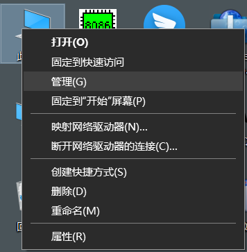
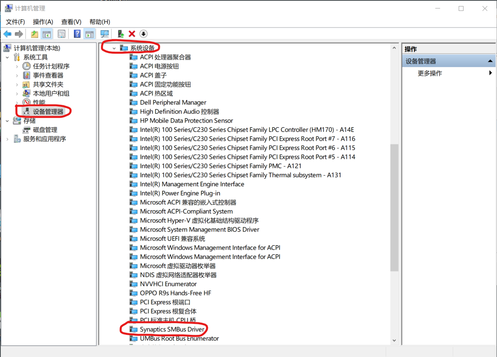
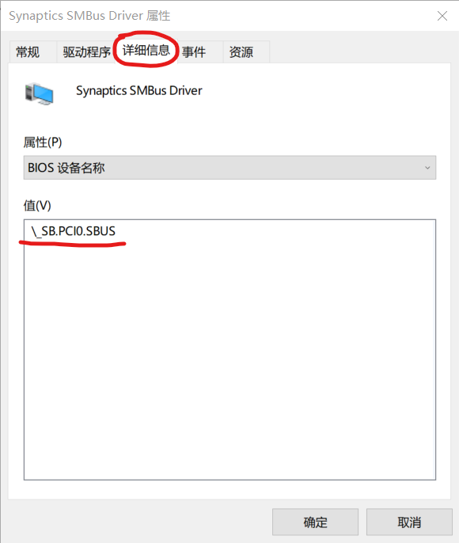
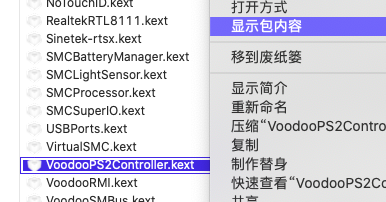
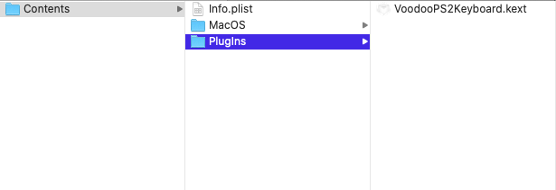
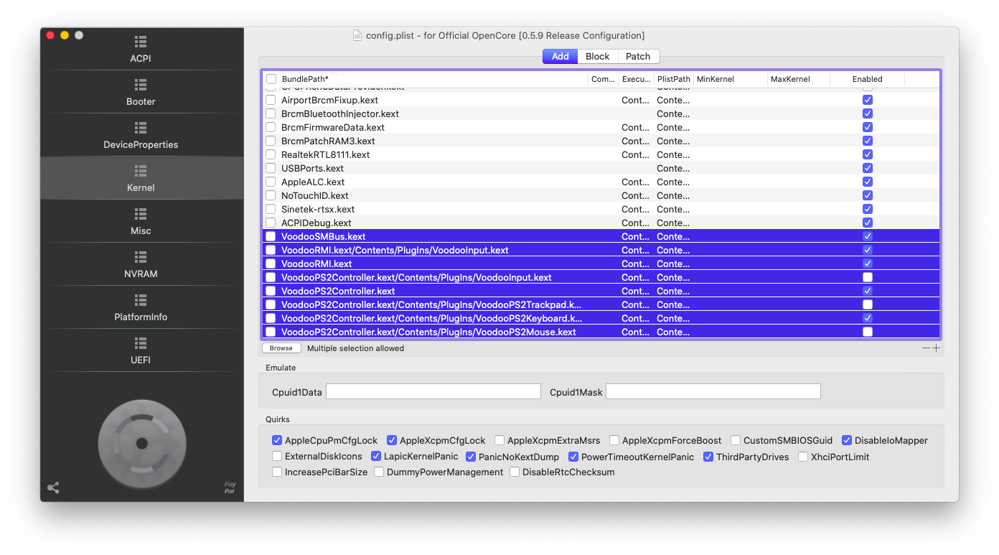
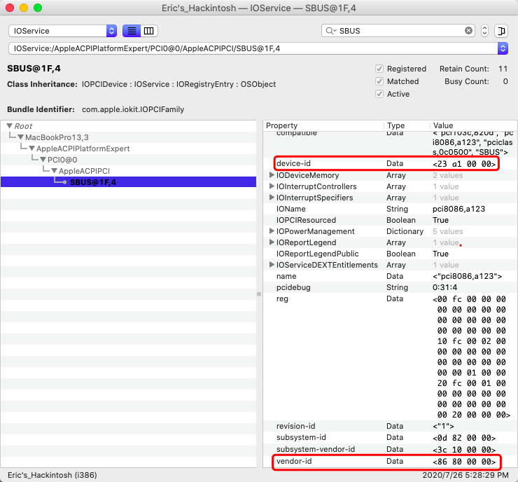
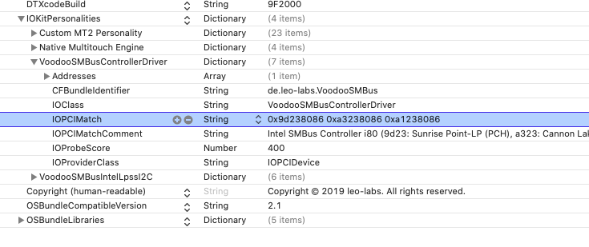

# 从 VoodooPS2 迁移到 VoodooRMI

## 0x0 VoodooRMI 的优势

直接与 SMBus 通信，延迟更低，且支持所有 macOS 手势，支持四指触控。


## 0x1 判断自己的触控板适不适合 VoodooRMI

- Windows下：

  右键点击「此电脑」，点击管理




切换到「设备管理器」，找到「系统设备」，在里面搜索「Synaptics SMBus Driver」，**如果找到的话说明你的电脑支持 SMBus 方式驱动**




你可以在「属性」-「详细信息」-「BIOS设备名称」中看到SMBus在总线中的位置，可以记录下来。




## 0x2 安装 VoodooSMBus

### ⚠️注意⚠️

VoodooSMBus 和 SSDT-SBUS 不兼容，在使用前请先禁用 SSDT-SBUS

同样地，Clover 下要取消 ACPI 下的 FixSBUS


### OC

在这里下载[VoodooSMBus](https://github.com/VoodooSMBus/VoodooSMBus/releases)。

在OC-Kernel-Block中禁用`com.apple.driver.AppleSMBusPCI`、`com.apple.driver.AppleSMBusController`、`com.apple.driver.AppleIntelLpssI2CController`、`com.apple.driver.AppleIntelLpssI2C`的加载。

这里有一个示例：

```
# 添加到 Kernel 下
<key>Block</key>
		<array>
			<dict>
				<key>Comment</key>
				<string></string>
				<key>Enabled</key>
				<true/>
				<key>Identifier</key>
				<string>com.apple.driver.AppleSMBusPCI</string>
				<key>MaxKernel</key>
				<string></string>
				<key>MinKernel</key>
				<string></string>
			</dict>
			<dict>
				<key>Comment</key>
				<string></string>
				<key>Enabled</key>
				<true/>
				<key>Identifier</key>
				<string>com.apple.driver.AppleSMBusController</string>
				<key>MaxKernel</key>
				<string></string>
				<key>MinKernel</key>
				<string></string>
			</dict>
			<dict>
				<key>Comment</key>
				<string></string>
				<key>Enabled</key>
				<true/>
				<key>Identifier</key>
				<string>com.apple.driver.AppleIntelLpssI2CController</string>
				<key>MaxKernel</key>
				<string></string>
				<key>MinKernel</key>
				<string></string>
			</dict>
			<dict>
				<key>Comment</key>
				<string></string>
				<key>Enabled</key>
				<true/>
				<key>Identifier</key>
				<string>com.apple.driver.AppleIntelLpssI2C</string>
				<key>MaxKernel</key>
				<string></string>
				<key>MinKernel</key>
				<string></string>
			</dict>
		</array>
```

如果键盘仍需要用 VoodooPS2 驱动的话，禁用`VoodooPS2Controller.kext/Contents/PlugIns/VoodooInput.kext`、`VoodooPS2Controller.kext/Contents/PlugIns/VoodooPS2Trackpad.kext`、`VoodooPS2Controller.kext/Contents/PlugIns/VoodooPS2Mouse.kext` 三个 VoodooPS2 的 Plugin。

否则直接删除 VoodooPS2 驱动和配置文件中 VoodooPS2 相关的配置项。

接着把我们下载好的 VoodooSMBus.kext 放到 kexts 文件夹下，在配置文件中增加 VoodooSMBus 相关配置项。


### Clover

在 KernelToPatch 中添加

```
			<dict>
				<key>Comment</key>
				<string>Prevent Apple I2C kexts from attaching to I2C controllers, credit CoolStar</string>
				<key>Find</key>
				<data>
				SU9LaXQ=
				</data>
				<key>InfoPlistPatch</key>
				<true/>
				<key>Name</key>
				<string>com.apple.driver.AppleIntelLpssI2C</string>
				<key>Replace</key>
				<data>
				SU9LaXM=
				</data>
			</dict>
			<dict>
				<key>Comment</key>
				<string>Prevent Apple I2C kexts from attaching to I2C controllers, credit CoolStar</string>
				<key>Find</key>
				<data>
				SU9LaXQ=
				</data>
				<key>InfoPlistPatch</key>
				<true/>
				<key>Name</key>
				<string>com.apple.driver.AppleIntelLpssI2CController</string>
				<key>Replace</key>
				<data>
				SU9LaXM=
				</data>
			</dict>
			<dict>
				<key>Comment</key>
				<string>Prevent Apple SMBus kexts from attaching to SMBUS controller</string>
				<key>Disabled</key>
				<false/>
				<key>Find</key>
				<data>
				SU9LaXQ=
				</data>
				<key>InfoPlistPatch</key>
				<true/>
				<key>Name</key>
				<string>com.apple.driver.AppleSMBusController</string>
				<key>Replace</key>
				<data>
				SU9LaXM=
				</data>
			</dict>
			<dict>
				<key>Comment</key>
				<string>Prevent Apple SMBus kexts from attaching to SMBUS controller</string>
				<key>Disabled</key>
				<false/>
				<key>Find</key>
				<data>
				SU9LaXQ=
				</data>
				<key>InfoPlistPatch</key>
				<true/>
				<key>Name</key>
				<string>com.apple.driver.AppleSMBusPCI</string>
				<key>Replace</key>
				<data>
				SU9LaXM=
				</data>
			</dict>
```

来阻止`com.apple.driver.AppleSMBusPCI`、`com.apple.driver.AppleSMBusController`、`com.apple.driver.AppleIntelLpssI2CController`、`com.apple.driver.AppleIntelLpssI2C`的加载。

如果仍需要 VoodooPS2 来驱动键盘，可以右键点击 VoodooPS2Controller.kext，点击「查看包内容」，在 Contents/Plugins 中删除 VoodooInput.kext、VoodooPS2Mouse.kext、VoodooPS2Trackpad.kext





接着将 VoodooSMBus.kext 放入 kexts/Other 下


## 安装 VoodooRMI

在这里下载 [VoodooRMI](https://github.com/VoodooSMBus/VoodooRMI/releases)。

将下载好的 VoodooRMI 安装到 OC、Clover 的 kexts 文件夹。

OC 用户要注意，需要把 `VoodooRMI.kext/Contents/PlugIns/VoodooInput.kext` 一同添加到配置文件中。




## 如果你的 VoodooSMBus 没有加载

如果你重启后发现你的触控板没有像预期那样工作，你可以在终端中输入

```
kextstat | grep -i voodoo
```

并回车。

如果结果中没有出现 `de.leo-labs.VoodooSMBus` ，则说明 VoodooSMBus 没有加载。

接着输入

```
kextstat | grep -i AppleSMBUSControllerPCI
```

并回车。

如果结果出现了 `AppleSMBUSControllerPCI`，你需要

- Clover：确定 FixSBUS 是关闭的，SSDT 中没有 SSDT-SBUS
- OpenCore：确定 SSDT 中没有 SSDT-SBUS


如果上面命令没有结果，我们可以打开 IORegistryExplorer，搜索 SBUS（之前在 Windows 下看到的 BIOS 设备名，见[0x1 判断自己的触控板适不适合 VoodooRMI]()，如果你的设备名不是 SBUS，这里要改成对应的名字）

找到 `device-id` 和 `vendor-id` 



将它们的前两位记录下来，并且倒置，比如我的 device-id `23 a1 00 00` 经过处理后就可以得到 `a123`

Vendor-id 也如法炮制

最终得到 device-id=`a123` 和 vendor-id=`8086` 

将 device-id 放在前面， vendor-id 放在后面，拼在一起，开头加上 `0x`

就得到了 `0xa1238086`

右键点击 VoodooSMBus.kext，点击「显示包内容」，修改 Contents/Info.plist

可以用 Xcode 或者 [ProperTree](https://github.com/corpnewt/ProperTree)



找到 IOKitPersonalities - VoodooSMBusControllerDriver - IOPCIMatch

在后面加上一个空格，并且把刚刚我们得到的 `0x` 开头的那串十六进制数粘贴进去

然后保存重启即可。


### 参考

https://github.com/VoodooSMBus/VoodooSMBus/blob/dev/README.md#voodoosmbus-does-not-load

