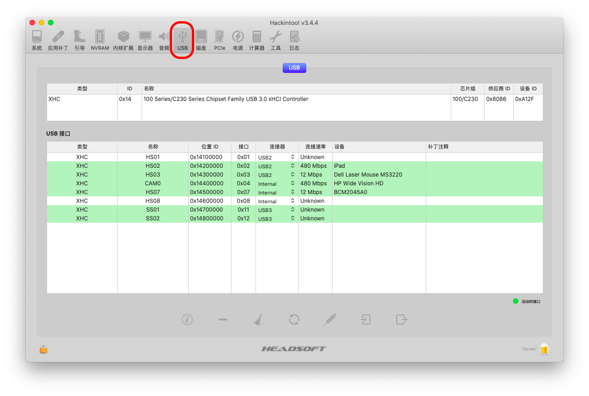
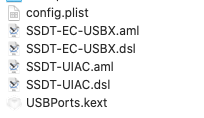

# 使用 Hackintool 进行 USB 定制

### 能实现的功能

1. 大电流输出（给iPad充电）
2. 将多余的USB口去掉（不过这台笔记本上没有什么多余的 USB 口）

### 准备

[Hackintool](https://github.com/headkaze/Hackintool/releases)

### 开始

打开 Hackintool，切换到 USB 选项卡

首先对于机身内部的设备（如蓝牙和摄像头），应该选择内置 Internal

接着，使用一个 USB 2.0 的设备和一个USB 3.0 的设备分别连接一遍所有的USB口，有活动的 USB 口应该会变成绿色底色。

我们按照使用的设备类型在「连接器」栏中选择：

- 若使用的是 USB 2.0 的设备，则此处选择 USB2
- 若使用的是 3.0 的设备，则此处选择 USB3
- 若使用的是Type-C的设备，则需要正反面分别连接：
  - 若正反两面激活了不同的 USB 接口，则两个接口都应选 TypeC
  - 若正反两面激活了同一个 USB 接口，则该接口选择TypeC+Sw（即换向器）

注意，有的设备同一个实体 USB 口会在操作系统中对应多个 USB 接口，比如这台笔记本就是，USB 2.0 和 USB 3.0 的设备插在同一个实体口上会识别出不同的 USB 接口，此时我们需要将 USB 2.0 和 USB 3.0 的设备都对所有实体 USB 接口插拔测试。

定制完成后点击右下角的导出图标

会在桌面上生成六个文件

如果已经做过 SSDT-EC-USBX.aml 的补丁的话，我们将 USBPorts.kext 放到 kexts 下面就可以了

否则需要**额外**把 SSDT-EC-USBX.aml 放在 ACPI 下（Clover为ACPI/Patch）

### Troubleshooting

如果 USBPorts.kext 似乎没有成功加载，我们可以通过 IOReg 搜索 USBX 来调试
