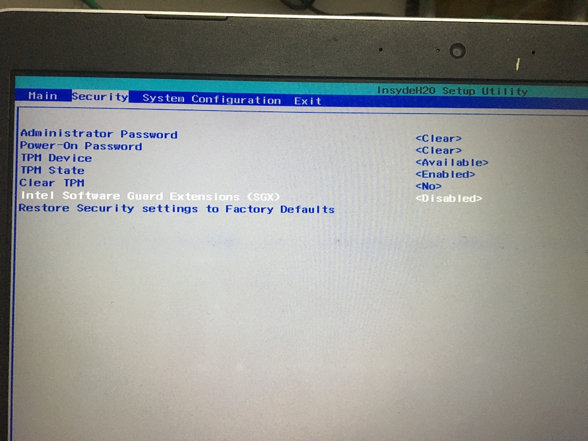
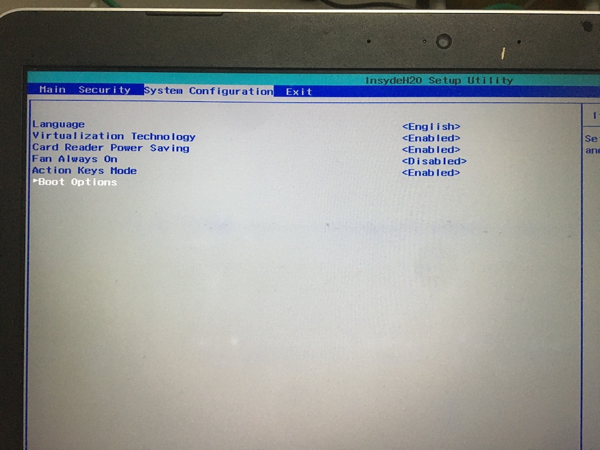
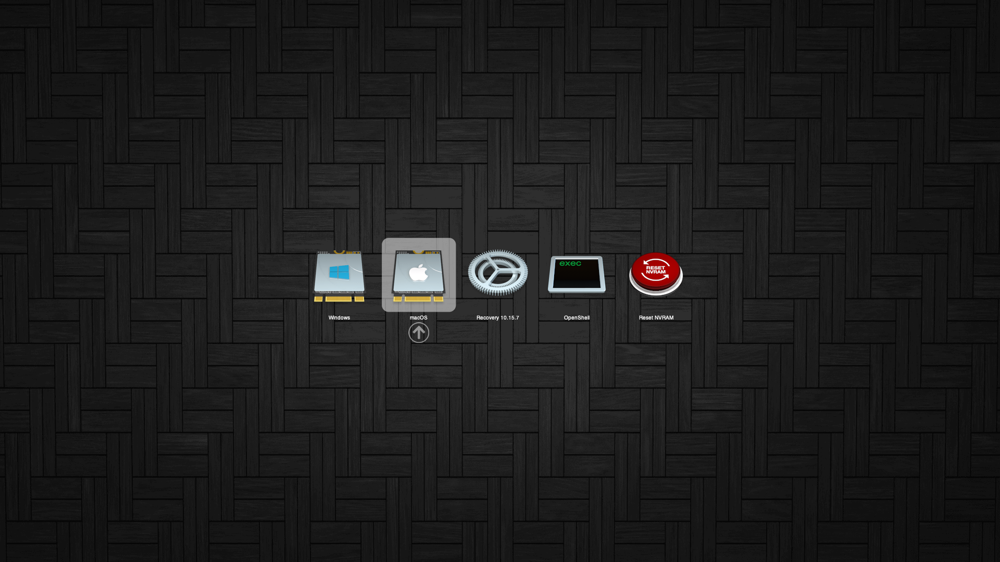
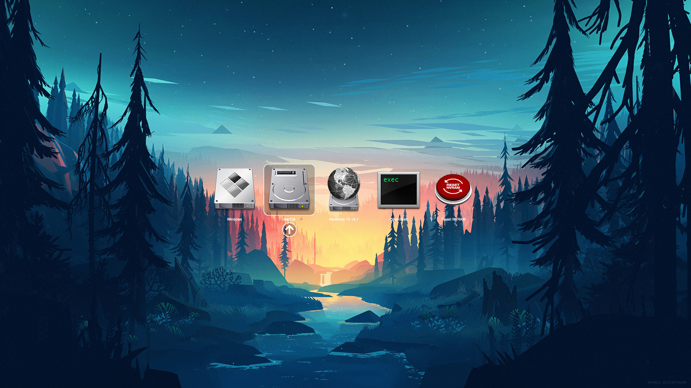

# HP Pavilion bc015tx Hackintosh

Language:

- [简体中文](README.md)
- [English](Translation/en/README.md)


| 规格      | 详细信息                                                     |
| --------- | ------------------------------------------------------------ |
| 电脑型号  | HP Pavilion bc015tx                                          |
| 处理器    | Intel Core i7-6700HQ                                         |
| 内存      | Hynix 8GB DDR4 2400 MHz                                      |
| 固态硬盘  | SAMSUNG MZNTY128HDHP-000H1 128GB                             |
| 机械硬盘  | HGST HTS721010A9E630 1TB                                     |
| 集成显卡  | Intel HD Graphics 530                                        |
| 独立显卡  | Nvidia GTX960M                                               |
| 声卡      | Realtek ALC295 (Layout ID = 24)                              |
| WIFI / BT | <ul><li>原装: Intel AC7265</li><li>更换后: DELL DW1820A (Pci14e4,43a3)</li></ul> |
| 有线网卡  | RTL8111/8168/8411 PCI Express Gigabit Ethernet Controller    |


## 如何使用

1. 在 [Release ](https://github.com/the-eric-kwok/HP-Pavilion-bc015tx-Hackintosh/releases/latest)中下载最新版本的 EFI

2. 如果你是在 Windows 下：

   1. 使用 TransMac 或 Etcher 将别人制作好的镜像烧录到 U 盘**（会清除 U 盘上所有数据）**
   2. 使用 Disk Genius 挂载 U 盘的 EFI 分区，并且在 Disk Genius 中使用此 EFI 替换掉原有的 EFI 文件夹
   3. 将 config-install.plist 重命名为 config.plist
   4. 重启选择 U 盘启动，进入安装进程

3. 如果你是在 macOS 下：

   1. 在 AppStore 中搜索 macOS 下载镜像，此处假设我们下载的是 macOS 10.15

   2. 插入 U 盘

   3. 打开终端

   4. 打开 Finder，在 `Applications` 文件夹中找到我们刚刚下载好的安装包 `Install macOS Catalina.app`

   5. 将这个安装包按住，拖动到终端窗口中松手，我们会发现它变成了一串路径，如 `/Applications/Install\ macOS\ Catalina.app`，此处如果末尾 .app 后面有空格的话要删掉空格

   6. 接着输入 `/Contents/Resources/createinstallmedia --volume`，此处注意 volume 前是双杠，volume 后加上一个空格

   7. 然后在桌面上找到我们的 U 盘图标，拖动到终端窗口中松手

   8. 此时将拼凑出一个命令，如 

      ```
      /Applications/Install\ macOS\ Catalina.app/Contents/Resources/createinstallmedia --volume /Volumes/FlashDisk
      ```

      回车执行，macOS会将镜像写入 U 盘**（将会抹除 U 盘中所有数据）**

   9. 使用 OpenCore Configurator 挂载 U 盘的 EFI 分区，将下载好的 EFI 放入其中

   10. 进入 EFI 文件夹中，将 config-install.plist 改名为 config.plist

   11. 将 U 盘插入目标机，选择 U 盘启动，进入安装进程

4. 安装完成后进入 macOS，下载 OpenCore Configurator，挂载系统盘和 U 盘的 EFI 分区

5. 进入 <u>U 盘 EFI 分区</u>中的 EFI 文件夹，将 BOOT 和 OC 两个文件夹复制到<u>系统盘 EFI 分区</u>下的 EFI 文件夹中。此处不能整个 EFI 替换，否则将会覆盖 Windows 启动项导致 Windows 无法启动

6. 进入 OC 文件夹，删除 config.plist，并根据你的无线网卡和系统版本选择需要的 config 并改名为 config.plist，假设你使用的是原装的 Intel AC7265 网卡，系统版本为 macOS 10.15，则将 config-Intel7265AC-Catalina.plist 改名为 config.plist 

7. 拔出 U 盘，重启进入系统


#### 我无法启动怎么办？

提交 [issue](https://github.com/the-eric-kwok/HP-Pavilion-bc015tx-Hackintosh/issues/new)，附上无法启动的屏幕照片，说明你安装的系统版本、使用的 EFI 版本，已经进行了什么操作等。信息越全面越容易被解决。


## 无法驱动

1. 独立显卡
2. HDMI输出（HDMI走的独显，故无解）
3. 启动提示音（[OC的锅](https://github.com/acidanthera/bugtracker/issues/740#issuecomment-734910619)）


## 正常功能

1. 核芯显卡
2. 声卡
3. USB 全部功能正常
4. 有线网卡
5. 无线网卡（更换为1820A后完美，可随航，原装卡(AC7265)可以考虑[itlwm](https://github.com/OpenIntelWireless/itlwm)配合[HeliPort](https://github.com/OpenIntelWireless/HeliPort)，但是性能还比较差，丢包严重）
6. 蓝牙（如果是原装卡用[IntelBluetoothFirmware](https://github.com/OpenIntelWireless/IntelBluetoothFirmware)）
7. 电池电量（SSDT-BatteryFix.dsl）
8. 触摸板手势可用（切换到VoodooRMI解决多指触控问题）
9. 睡眠基本正常
10. 变频正常
11. 支持原生亮度快捷键（BrightnessKey.kext）
12. 支持原生多媒体控制键（自动支持了）
13. 支持读卡器（通过Sinetek-rtsx.kext）
14. 交换了左侧的 Windows（现为⌘）和 Alt（现为⌥）键，右侧 Alt 依旧作为 ⌘ 键，方便使用删除文件快捷键（SSDT-SwapCmdOpt.dsl）


## 关于 1820A

如果你没有更换自己的网卡的话**不需要**以下kext：

- BrcmBluetoothInjector.kext
- BrcmFirmwareData.kext
- BrcmPatchRAM3.kext
- AirportBrcmFixup.kext


## BIOS设置

开机时按下 F10 进入 BIOS 设置，禁用 Intel SGX 和安全启动






## 主题

EFI中内置了三款主题，分别是：

Default:




Modern:


Old:




你可以在 config.plist 的 Misc -> Boot -> PickerVariant 中切换。


## ⚠️警告⚠️

十分不建议直接下载kexts文件夹中的kext使用，你应该按照对应的kext名字进行搜索，并且使用最新版本的kext。

SSDT中的dsl文件需要用MaciASL或者AIDA64工程版或者iASL编译成aml文件再放到ACPI下注入

```
# 命令行中输入此命令
iasl SSDT-xxx.dsl

# Windows下可能是这样的
# C:\User\Someone\Downloads\iasl.exe SSDT=xxx.dsl
```

添加了SSDT-aml文件夹，如果不方便编译的可以先添加一些必备的SSDT，但是**一定要按照dsl文件中的注释进行二进制替换（即OC config ACPI中的Patch栏）！**

必备的SSDT：

- SSDT-EC-USBX
- SSDT-NDGP_OFF
- SSDT-PLUG-_PR.CPU0
- SSDT-PNLF-SKL_KBL
- SSDT-SBUS
- ~~SSDT-ALS0~~ 现在合并入 SSDT-AddDev 了

其他的SSDT多为完善功能用，其重要性并没有上面这些重要。建议先确保系统能进去了再一个个试着添加。

如果进不去系统，请参照[OC-Little](https://github.com/daliansky/OC-little/)对自己的SSDT进行调整。

我的SSDT很多都是照抄OC-Little库中的，所以OC-Little**一定要自己看了理解实践**，这样才能打造一个属于你的完美黑苹果！

**BTW，SSDT-BATT和SSDT-Battery功能重复，都是电池热补丁，不过一个是Pavilion 15 通用型补丁，一个是bc015tx专用的补丁，可以根据喜好选择编译使用**

**此外，安装时你应该将 OC-config.plist - NVRAM 下的`csr-active-config`设置为`00000000`**

## 链接

[OpenCorePkg](https://github.com/acidanthera/OpenCorePkg/releases)

[Clover](https://github.com/CloverHackyColor/CloverBootloader/releases)

[OC-Little](https://github.com/daliansky/OC-little/)


## 打赏


## 目录

[关于 1820A 网卡](Docs/About_1820A.md)

[关于原装 Intel AC7265 网卡](Docs/About_Intel_AC7265.md)

[使用 Hackintool 进行 USB 定制](Docs/使用Hackintool进行USB定制.md)

[从 VoodooPS2 迁移到 VoodooRMI](Docs/从VoodooPS2迁移到VoodooRMI.md)

[修复开机时的突然断电重启](Docs/修复开机时的突然断电重启.md)

[修复耳机切换的bug](Docs/修复耳机切换的bug.md)

