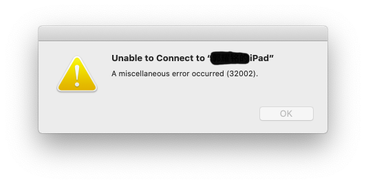
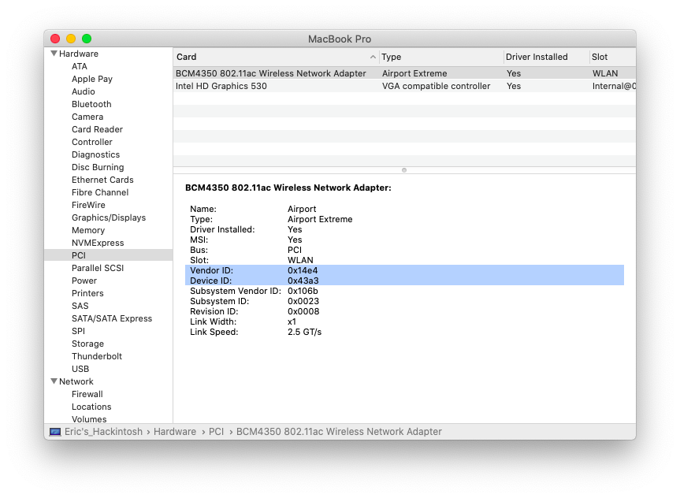

# About 1820A

First of all, you don't need these kexts if you didn't replace you wifi card.

- BrcmBluetoothInjector.kext
- BrcmFirmwareData.kext
- BrcmPatchRAM3.kext
- AirportBrcmFixup.kext


## Caution

AirportBrcmFixup.kext is WiFi driver, and the rest of three are bluetooth. 

Make sure you loaded BrcmBluetoothInjector.kext first. So OpenCore is recommended as you can control which kext load first. Otherwise bluetooth may be unusable.

BTW, if you are using Mojave or older macOS, you should replace [BrcmPatchRam3.kext](http://7.daliansky.net/DW1820A/DW1820A_BT_for_Catalina_v2.5.3.zip) with [BrcmPatchRam2.kext](http://7.daliansky.net/DW1820A/DW1820A_BT_for_Mojave_v2.5.3.zip).


## For Big Sur User

There are only AirPortBrcmNIC in Big Sur so...

**Only 3 models of 1820A is compatible with Big Sur:**

- Pci14e4,43ba
- Pci14e4,43a3
- Pci14e4,43a0

Sidecar is usable by default so you can ignore contents below.

See [AirportBrcmFixup](https://github.com/acidanthera/AirportBrcmFixup)


## Sidecar

### Fixes

Error 32002



### For

1820A of these models

- Pci14e4,43ba
- Pci14e4,43a3
- Pci14e4,43a0

You can check your model in **System Report**, my card is Pci14e4,43a3.




### References：

[DW1820A/BCM94350ZAE/BCM94356ZEPA50DX插入的正确姿势](https://blog.daliansky.net/DW1820A_BCM94350ZAE-driver-inserts-the-correct-posture.html)

[AirportBrcmFixup](https://github.com/acidanthera/AirportBrcmFixup)


### Sidecar Guide：

First you should make sure your card is fully working include Wi-Fi and Bluetooth. 

Open **System Report** - Software - Extensions, you should see AirPortBrcm4360:

```
AirPortBrcm4360：


  Version:         14.0
  Last Modified:   2020/1/10, 2:30 PM
  Bundle ID:       com.apple.driver.AirPort.Brcm4360
  Notarized:       Yes
  Loaded:          Yes
  ...
```

AirPortBrcmNIC：

```
AirPortBrcmNIC：


  Version:         14.0
  Last Modified:   2020/1/10, 2:30 PM
  Bundle ID:       com.apple.driver.AirPort.BrcmNIC
  Notarized:       Yes
  Loaded:          No
  ...
```

Let's launch OpenCore Configurator, inside **DeviceProperties**, delete `compatible` property from you WiFi card PciPath. 

Then goto **NVRAM**, select UUID `7C436110-AB2A-4BBB-A880-FE41995C9F82` , add `brcmfx-driver=2` into **boot-args**. 


If you're using Clover, delete `compatible` in **Devices** - **Properties**. 

Then goto **Boot**, click + at the right button of **Arguments** and fill the blank with `brcmfx-driver=2` 


This argument force macOS to load AirPortBrcmNIC instead of AirPortBrcm4360, which can drive Sidecar. 

Here is the README from AirportBrcmFixup

> brcmfx-driver=0|1|2|3: enables only one kext for loading, 0 - AirPortBrcmNIC-MFG, 1 - AirPortBrcm4360, 2 - AirPortBrcmNIC, 3 - AirPortBrcm4331, also can be injected via DSDT or Properties → DeviceProperties in bootloader

Save and reboot. Check **System Report** - Software - Extensions again, you should see macOS loaded AirPortBrcmNIC. 

```
AirPortBrcmNIC：


  Version:         14.0
  Last Modified:   2020/1/10, 2:30 PM
  Bundle ID:       com.apple.driver.AirPort.BrcmNIC
  Notarized:       Yes
  Loaded:          Yes
  ...
```

Now you can try to Sidecar with iPad. 

BTW, this may make Apple Watch unlock usable, but I've not tested it.


 