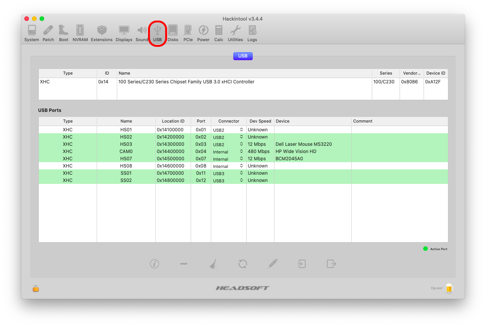
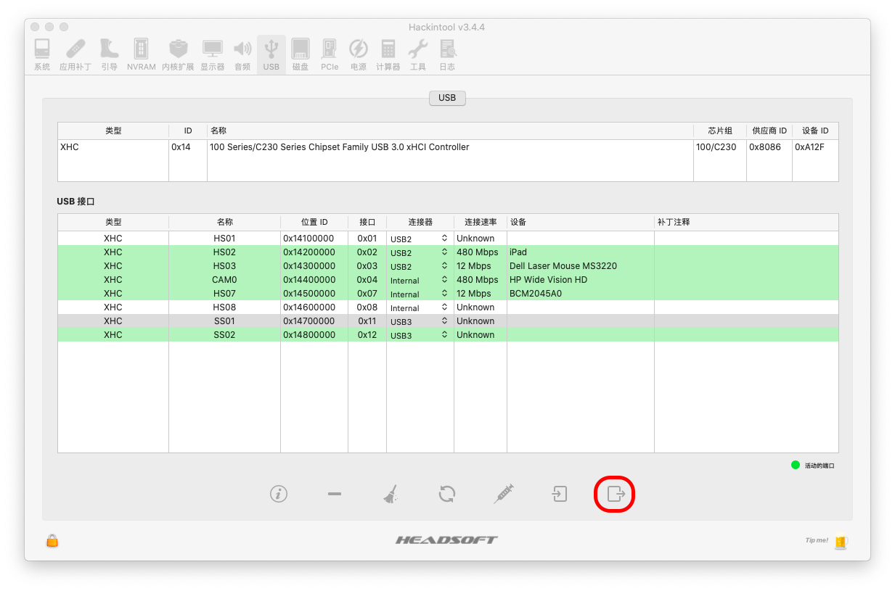

# Patching USB with Hackintool

### What to be expected

1. Fix High Current ( to charge iPad )
2. Remove useless USB port ( there are no useless port on this laptop )

### Prepare

[Hackintool](https://github.com/headkaze/Hackintool/releases)

### Guide

Launch Hackintool, switch to USB tab.

For devices inside laptop, such as Bluetooth and Camara, we should choose **Internal**. 

Then use a USB 2.0 stick **AND** a USB 3.0 stick to plug in **ALL** USB port. Those ports which is active will be shown as green. 

Choose type in **Connector**:

- If we're plugged USB 2.0 stick in, choose USB2
- If we're plugged USB 3.0 stick in, choose USB3
- If we're plugged in Type-C device, we should flip it and reconnect:
  - If there are 2 lines active by 1 USB port, those 2 lines should both be TypeC
  - If there are only 1 line active by 1 USB port, it should be TypeC+Sw (Switcher)

Be aware, on some machine, 1 actual USB port is mapped to 2 or many line. So we should test ALL ports with both USB2 and USB3 stick. 

When it's all done, click export button at the right button.

There will be 6 files exported to Desktop:

If you already done SSDT-EC-USBX.aml patch, just copy USBPorts.kext to kexts folder and reboot.

Otherwise you should copy SSDT-EC-USBX.aml to ACPI ,or ACPI/Patch if you're using Clover, as well.

### Troubleshooting

If USBPorts.kext seems to be failed to load, we can dig the problem by searching USBX in IOReg. 