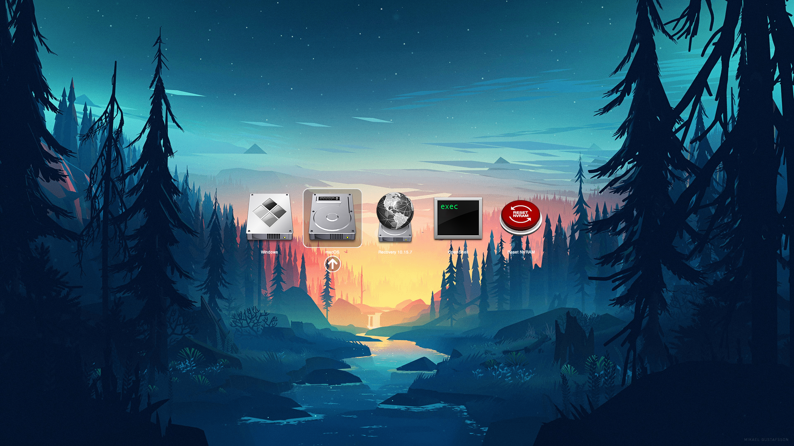

# HP Pavilion bc015tx Hackintosh


## Catalog

[About 1820A](About_1820A.md)

[About Intel AC7265](About_Intel_AC7265.md)

[Patching USB with Hackintool](Patching_USB_with_Hackintool.md)

[Fixing Suddenly Poweroff On BIOS Stage](Fixing_Suddenly_Poweroff_On_BIOS_Stage.md)


| Part       | Info                                                         |
| ---------- | ------------------------------------------------------------ |
| Model      | HP Pavilion bc015tx                                          |
| CPU        | Intel Core i7-6700HQ                                         |
| Mem        | Hynix 8GB DDR4 2400 MHz                                      |
| SSD        | SAMSUNG MZNTY128HDHP-000H1 128GB                             |
| HDD        | HGST HTS721010A9E630 1TB                                     |
| IGPU       | Intel HD Graphics 530                                        |
| DGPU       | Nvidia GTX960M                                               |
| Sound Card | Realtek ALC295 (Layout ID = 28 or 77)                        |
| WIFI / BT  | <ul><li>Original: Intel AC7265</li><li>Replacement: DELL DW1820A (Pci14e4,43a3)</li></ul> |
| Ethernet   | RTL8111/8168/8411 PCI Express Gigabit Ethernet Controller    |


## Usage

1. Download latest EFI in [GitHub Release Page](https://github.com/the-eric-kwok/HP-Pavilion-bc015tx-Hackintosh/releases/latest) or [Gitee Release Page](https://gitee.com/erickwok404/HP-Pavilion-bc015tx-Hackintosh/releases)

2. If you are under Windows:

   1. Write installer to your flash disk via TransMac or Etcher. **This will erase all data from your flash disk**
   2. Mount EFI partition of your flash disk with Disk Genius, and replace the original EFI with downloaded one.
   3. Rename config-install.plist to config.plist
   4. Reboot and press F9 to select boot from flash disk
   5. Install

3. If you are under macOS:

   1. Search macOS in AppStore and download it. Assuming we're downloading macOS 10.15

   2. Insert your USB flash disk

   3. Open Terminal.app

   4. Open Finder, find `Install macOS Catalina.app` under `Applications`

   5. Drag and drop this app to terminal. It will be convert to a string of path, such as `/Applications/Install\ macOS\ Catalina.app`. Note that if there is a space behind `.app`, delete that space.

   6. then input `/Contents/Resources/createinstallmedia --volume`. Note that there is double-slash in front of `volume`, and a space behind it.

   7. Goto desktop, drag and drop the USB flash icon to terminal

   8. Finally we got a command, such as

      ```
      /Applications/Install\ macOS\ Catalina.app/Contents/Resources/createinstallmedia --volume /Volumes/FlashDisk
      ```

      and hit return. The createinstallmedia tool will write the installer to your USB flash. **This will erase all data from your flash disk**

   9. Mount EFI partition of USB flash with OpenCore Configurator, and put the EFI folder into it.

   10. Goto EFI folder inside EFI partition and rename config-install.plist to config.plist

   11. Eject flash disk and insert it to your target machine. Boot with key F9 pressed and select boot from USB flash disk.

4. After installation, boot into macOS, install OpenCore Configurator and mount both system EFI partition and EFI partition of your USB flash.

5. Goto EFI folder under <u>EFI partition of your USB flash</u>. Then copy BOOT and OC folder to EFI folder under <u>system EFI partition</u>. Note that on this step, do not replace entire EFI folder because there might be a Microsoft boot loader in your original EFI. Delete that means you cannot boot into Windows anymore.

6. Goto OC folder and delete config.plist. Then chose config file according to your Wi-Fi card and system version. For example I'm using Intel Wireless 7265 AC and macOS 10.15, I rename `config-Intel7265AC-Catalina.plist` to `config.plist`

7. Eject USB flash and reboot into macOS


#### What if my machine refuse to boot

Submit an [issue](https://github.com/the-eric-kwok/HP-Pavilion-bc015tx-Hackintosh/issues/new), attach the screenshot of where you stuck, which version of macOS are you using, which version of EFI are you using, etc. 


## Not Working

1. Nvidia DGPU
2. HDMI output


## Working

1. Intel iGPU
2. Sound
3. USB
4. Ethernet
5. Wi-Fi (Works perfectly after replace with 1820A, Sidecar, Handoff, Airdrop is working as well. If you are using the original card, you can consider about [itlwm](https://github.com/OpenIntelWireless/itlwm) with [HeliPort](https://github.com/OpenIntelWireless/HeliPort), but the package loss is a pain in the ass. )
6. Bluetooth (Original card use [IntelBluetoothFirmware](https://github.com/OpenIntelWireless/IntelBluetoothFirmware)）
7. Battery percentage（SSDT-BatteryFix.dsl）
8. Trackpad
9. Sleep
10. CPU power management
11. Brightness keys (BrightnessKey.kext)
12. Media keys
13. Card reader (by Sinetek-rtsx.kext)
14. Switch between left Windows (now is ⌘) and Alt (now is ⌥ ). Right Alt remains as ⌘, so the `⌘Del` is more convincing (by SSDT-SwapCmdOpt.dsl)


## Supported OS version

Only tested on Catalina and Big Sur.


## About 1820A

Without replacement of 1820A you **DONT NEED** these kexts:

- BrcmBluetoothInjector.kext
- BrcmFirmwareData.kext
- BrcmPatchRAM3.kext
- AirportBrcmFixup.kext


## BIOS Settings

Press F10 at boot time to enter BIOS, disable Intel SGX and Secure Boot.


 

## FIx Headphone Jack And Mute Indicator

See [here](../../ALCPlugFix/README.md)

### How Does It Work?

Send `SET_PIN_WIDGET_CONTROL` command to `IOHDACodecDevice`, set Pin-ctls of node 0x19 to 0x24 to make Headphone Jack works.

And the mute indicator will turn on if Pin-ctls of node 0x1b is setted to 0x1, or turn off if it's setted to 0x0. So I modified the code of ALCPlugFix to make it able to listen to mute event of OS, and set node 0x1b to 0x1 when OS is muted, or 0x0 otherwise.


## Themes

There are 3 themes in my EFI, they are:

Default:


Modern:


Old:




You can select between them inside your config.plist: Misc -> Boot -> PickerVariant


For other themes, see:
- [Dortina Guide](https://dortania.github.io/OpenCore-Post-Install/cosmetic/gui.html)
- [LuckyCrack/OpenCore-Themes](https://github.com/LuckyCrack/OpenCore-Themes)
- [chris1111/My-Simple-OC-Themes](https://github.com/chris1111/My-Simple-OC-Themes)
- [LAbyOne/OpenCore-Themes-Downloader](https://github.com/LAbyOne/OpenCore-Themes-Downloader)

## Common issues

### If your battery percentage won't update / won't charge
ACEL device is an accelerometer which provides falling protection for hard disk. But in its ADJT method there is a wrong SMWR calling, and causing Embedding Controller read/write failed under macOS. So that there will be problems such as battery percentage won't update, or battery won't charge, and these problems will occur under Windows once it happened in macOS.

There are two ways to fix this:

1. Disable ACEL
   
    We can rename \_STA method in ACEL to XSTA, and place a new \_STA method in our SSDT to replace it:
    
    **This way you should look for the binary patch with HexFiend by yourself. Remember to extend the binary string to make it unique in DSDT (because there are many many devices inside your DSDT, and each device has a \_STA method)**
    
    Example \_STA code:
    ```
    Scope (\_SB.PCI0.ACEL)
    {
        Method (_STA, 0, NotSerialized) 
        {
            If (_OSI("Darwin")) 
            {
                Return (0)
            }
            Else 
            {
                Return(XSTA())
            }
        }
    }
    ```
   
2. Fix ADJT

    We can rename ADJT method to XDJT, and place a new ADJT method in our SSDT to replace it. 
    
    Rename patch:
    
    ```
    Comment: [BATT] Rename ADJT to XDJT
    Find:    4143454C 08
    Replace: 5843454C 08
    ```

    Original code:
    
    ```
    Scope (\_SB.PCI0.ACEL)
    {
        Method (ADJT, 0, Serialized)
        {
            If (_STA ())
            {
                If (LEqual (^^LPCB.EC0.ECOK, One))
                {
                    Store (^^LPCB.EC0.SW2S, Local0)
                }
                Else
                {
                    Store (PWRS, Local0)
                }

                If (LAnd (LEqual (^^^LID0._LID (), Zero), LEqual (Local0, Zero)))
                {
                    If (LNotEqual (CNST, One))
                    {
                        Store (One, CNST)
                        Store (Zero, ^^LPCB.EC0.PLGS)
                        ^^LPCB.EC0.SMWR (0xC6, 0x50, 0x24, Zero)
                        Sleep (0x0BB8)
                        ^^LPCB.EC0.SMWR (0xC6, 0x50, 0x36, 0x14)
                        ^^LPCB.EC0.SMWR (0xC6, 0x50, 0x37, 0x10)
                        ^^LPCB.EC0.SMWR (0xC6, 0x50, 0x34, 0x2A)
                        ^^LPCB.EC0.SMWR (0xC6, 0x50, 0x22, 0x20)
                    }
                }
                ElseIf (LNotEqual (CNST, Zero))
                {
                    Store (Zero, CNST)
                    ^^LPCB.EC0.SMWR (0xC6, 0x50, 0x22, 0x40)  // <------
                    ^^LPCB.EC0.SMWR (0xC6, 0x50, 0x36, One)
                    ^^LPCB.EC0.SMWR (0xC6, 0x50, 0x37, 0x50)
                    ^^LPCB.EC0.SMWR (0xC6, 0x50, 0x34, 0x7F)
                    ^^LPCB.EC0.SMWR (0xC6, 0x50, 0x24, 0x02)
                    Store (One, ^^LPCB.EC0.PLGS)
                }
            }
        }
    }
    ```

    Move the pointed line to the buttom

    Modified code:
    
    ```
    Scope (\_SB.PCI0.ACEL)
    {
        Method (ADJT, 0, Serialized)
        {
            If (_STA ())
            {
                If (LEqual (^^LPCB.EC0.ECOK, One))
                {
                    Store (^^LPCB.EC0.SW2S, Local0)
                }
                Else
                {
                    Store (PWRS, Local0)
                }

                If (LAnd (LEqual (^^^LID0._LID (), Zero), LEqual (Local0, Zero)))
                {
                    If (LNotEqual (CNST, One))
                    {
                        Store (One, CNST)
                        Store (Zero, ^^LPCB.EC0.PLGS)
                        ^^LPCB.EC0.SMWR (0xC6, 0x50, 0x24, Zero)
                        Sleep (0x0BB8)
                        ^^LPCB.EC0.SMWR (0xC6, 0x50, 0x36, 0x14)
                        ^^LPCB.EC0.SMWR (0xC6, 0x50, 0x37, 0x10)
                        ^^LPCB.EC0.SMWR (0xC6, 0x50, 0x34, 0x2A)
                        ^^LPCB.EC0.SMWR (0xC6, 0x50, 0x22, 0x20)
                    }
                }
                ElseIf (LNotEqual (CNST, Zero))
                {
                    Store (Zero, CNST)
                    ^^LPCB.EC0.SMWR (0xC6, 0x50, 0x36, One)
                    ^^LPCB.EC0.SMWR (0xC6, 0x50, 0x37, 0x50)
                    ^^LPCB.EC0.SMWR (0xC6, 0x50, 0x34, 0x7F)
                    ^^LPCB.EC0.SMWR (0xC6, 0x50, 0x24, 0x02)
                    Store (One, ^^LPCB.EC0.PLGS)
                    ^^LPCB.EC0.SMWR (0xC6, 0x50, 0x22, 0x40)  // <------
                }
            }
        }
    }
    ```
    

**After fixed, press down power button for longer then 10s to reset EC, and then boot up, you will see the fix works.**

### If your battery percentage is not accurate

    Check the \_BST method in your DSDT and see whether it includes these lines:
    
    ```
    If (LEqual (BRTE, Zero))
    {
        Store (0xFFFFFFFF, Index (PBST, One))
    }
    ```
    
    If so, place \_BST method below to SSDT-BATT and apply the rename patch:
    
    ```
    Method (_BST, 0, NotSerialized)  // _BST: Battery Status
    {
        If (LEqual (^^PCI0.LPCB.EC0.ECOK, One))
        {
            If (^^PCI0.LPCB.EC0.MBTS)
            {
                UPBS ()
            }
            Else
            {
                IVBS ()
            }
        }
        Else
        {
            IVBS ()
        }
    
        //If (LEqual (BRTE, Zero))  //Comment out these 3 lines
        //{
        //    Store (0xFFFFFFFF, Index (PBST, One))
        //}
    
        Return (PBST)
    }
    ```
    
    Rename patch:
    
    ```
    Comment: Rename _BST to XBST
    Find:    5F425354 00
    Replace: 58425354 00
    ```
    
    And reboot to fix.


## Links

[OpenCorePkg](https://github.com/acidanthera/OpenCorePkg/releases)

[Clover](https://github.com/CloverHackyColor/CloverBootloader/releases)

[OC-Little](https://github.com/daliansky/OC-little/)

[Dortania Guide](https://dortania.github.io/OpenCore-Install-Guide/)

[Full ACPI Specification](https://uefi.org/sites/default/files/resources/ACPI_6_3_May16.pdf)


## Donation
With [PayPal](https://paypal.me/theerickwok)


## Credit

**Acidanthera** for OpenCore, Lilu, VirtualSMC, WhateverGreen and most of the kext we used

**OpenIntelWireless** for Itlwm (Intel WiFi driver) and IntelBluetoothInjector

**RehabMan** for ACPIBatteryManager, FakeSMC, USBInjectAll, MaciASL

**Dortania** for Dortania Guide

**black-dragon74** for ALCPlugFix-Swift

**daliansky**, **athlonreg**, **xjn819**, **GZXiaoBai**, **Bat.bat**, **Sukka** for OC-little guide and other guides

**Sukka** for [oc.skk.moe](https://oc.skk.moe)

